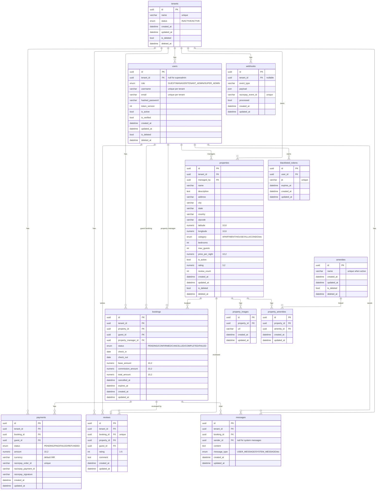

---
hide:
  - navigation
---

# System Modules

## Module Breakdown

## Users Module

**User**

*   Represents a system user, scoped to a tenant.
*   **Fields**:
    *   `username` (String, Index, Unique per Tenant)
    *   `email` (String, Index, Unique per Tenant)
    *   `hashed_password` (String)
    *   `role` (Enum: `SUPER_ADMIN`, `TENANT_ADMIN`, `MANAGER`, `GUEST`, Default: `GUEST`)
    *   `tenant` (FK → Tenant, Nullable)
    *   `is_active` (Boolean, Default: False)
    *   `is_verified` (Boolean, Default: False)
    *   `token_version` (Integer, Default: 1)
*   **Key Logic**:
    *   Soft deletion support (inherits `Base`).
    *   Unique constraints on `(tenant, email)` and `(tenant, username)` where active.
    *   Relationships: `blacklisted_tokens` (One-to-Many).

**BlacklistedToken**

*   Used for JWT revocation.
*   **Fields**:
    *   `user` (FK → User)
    *   `jti` (String, Unique)
    *   `expires_at` (DateTime)

## Tenants Module

**Tenant**

*   Represents the organization/account context.
*   **Fields**:
    *   `name` (String, Unique)
    *   `status` (Enum: `ACTIVE`, `INACTIVE`, Default: `ACTIVE`)
*   **Key Logic**:
    *   Central entity for multi-tenancy rules.
    *   Soft deletion support.
    *   Relationships to almost all other modules (`users`, `properties`, `bookings`, `payments`, etc.).

## Properties Module

**Property**

*   Represents a rental unit/property.
*   **Fields**:
    *   `tenant` (FK → Tenant)
    *   `managed_by` (FK → User - Manager)
    *   `name` (String)
    *   `description` (Text, Optional)
    *   `address`, `city` (Index), `state`, `country`, `zipcode` (String)
    *   `latitude`, `longitude` (Numeric 10,6)
    *   `category` (Enum: `APARTMENT`, `VILLA`, `HOTEL_ROOM`, `DORM`)
    *   `bedrooms` (Int), `max_guests` (Int)
    *   `price_per_night` (Numeric 10,2, Index)
    *   `is_active` (Boolean)
    *   `rating` (Numeric, Default: 0.0), `review_count` (Int, Default: 0)
*   **Key Logic**:
    *   Soft deletion support.
    *   Relationships: `images`, `amenities`, `bookings`, `reviews`.

**PropertyImage**

*   Images associated with a property.
*   **Fields**:
    *   `property` (FK → Property)
    *   `url` (String)

**Amenity**

*   Features or amenities available at properties.
*   **Fields**:
    *   `name` (String)
*   **Key Logic**:
    *   Global scope (not tenant-specific in model definition).
    *   Unique `name` (where active).
    *   Soft deletion support.

## Bookings Module

**Booking**

*   Represents a reservation of a property by a guest.
*   **Fields**:
    *   `tenant` (FK → Tenant)
    *   `property` (FK → Property)
    *   `guest` (FK → User)
    *   `manager` (FK → User - Property Manager)
    *   `status` (Enum: `PENDING`, `CONFIRMED`, `FAILED`, `CANCELLED`)
    *   `check_in` (Date), `check_out` (Date)
    *   `base_amount`, `commission_amount`, `total_amount` (Numeric 10,2)
    *   `expires_at` (DateTime), `cancelled_at` (DateTime, Optional)
*   **Key Logic**:
    *   **No** soft deletion (Transactional record).
    *   Constraints: `check_in < check_out`, `total_amount >= 0`.
    *   Indexes: `(tenant, status)`, `check_in`, `created_at`.

## Payments Module

**Payment**

*   Tracks payment transactions (Razorpay integration).
*   **Fields**:
    *   `tenant` (FK → Tenant)
    *   `booking` (FK → Booking)
    *   `guest` (FK → User)
    *   `status` (Enum: `PENDING`, `PAID`, `FAILED`, `REFUNDED`)
    *   `amount` (Numeric 10,2), `currency` (String, Default: "INR")
    *   `razorpay_order_id` (String, Unique)
    *   `razorpay_payment_id`, `razorpay_signature` (String, Optional)
*   **Key Logic**:
    *   **No** soft deletion.
    *   Constraints: `amount >= 0`.
    *   Indexes: `(tenant, status)`, `created_at`.

**Webhook**

*   Logs external webhook events (e.g., from Razorpay).
*   **Fields**:
    *   `tenant` (FK → Tenant, Nullable)
    *   `event_type` (String)
    *   `payload` (JSON)
    *   `razorpay_event_id` (String, Unique)
    *   `processed` (Boolean)
*   **Key Logic**:
    *   **No** soft deletion.

## Reviews Module

**Review**

*   Feedback provided by a guest for a booking.
*   **Fields**:
    *   `tenant` (FK → Tenant)
    *   `booking` (FK → Booking, Unique)
    *   `property` (FK → Property)
    *   `guest` (FK → User)
    *   `rating` (Integer)
    *   `comment` (Text)
*   **Key Logic**:
    *   **No** soft deletion.
    *   One review per booking (`booking_id` is Unique).
    *   Constraints: `rating BETWEEN 1 AND 5`.

## Messages Module

**Message**

*   Communication between users related to a booking.
*   **Fields**:
    *   `tenant` (FK → Tenant)
    *   `booking` (FK → Booking)
    *   `sender` (FK → User, Nullable for System messages)
    *   `content` (Text)
    *   `message_type` (Enum: `USER_MESSAGE`, `SYSTEM_NOTIFICATION`)
*   **Key Logic**:
    *   **No** soft deletion.

## Database Design

### Key Design Principles

*   **Multi-tenancy**: High isolation. Logic is enforced via `TenantMixin` which adds `tenant_id` (Foreign Key to `tenants`) to almost all entity models (`User`, `Property`, `Booking`, `Payment`, `Review`, `Message`, `Webhook`).
*   **Soft Deletion**: Implemented via `SoftDeleteMixin` (`is_deleted`, `deleted_at`) for lifecycle entities (`Tenant`, `User`, `Property`, `Amenity`). Transactional entities (`Booking`, `Payment`, `Review`) use status flags instead to preserve history.
*   **UUIDs**: All primary keys are UUIDs (`UUIDMixin`), ensuring unique identification across the distributed system.
*   **Enums**: Business logic states are strictly typed using Python Enums mapped to database values.

## Indexes & Constraints Overview

### Uniqueness

*   `tenants.name`
*   `users(tenant_id, email)` (Active records)
*   `users(tenant_id, username)` (Active records)
*   `amenities.name` (Active records)
*   `payments.razorpay_order_id`
*   `webhooks.razorpay_event_id`
*   `reviews.booking_id` (One review per booking)
*   `blacklisted_tokens.jti`

### Performance Indexes

*   **Users**: `token_version`, `role` (via composite indexes on tenant/username/email sometimes, but explicitly on `username` and `email`).
*   **Properties**: `city`, `category`, `price_per_night`, `managed_by`.
*   **Bookings**: `(tenant_id, status)`, `check_in`, `created_at`.
*   **Payments**: `(tenant_id, status)`, `created_at`.
*   **Messages**: `booking_id`.
*   **Global**: `tenant_id` is indexed on all tenant-scoped models via `TenantMixin`.

### Check Constraints

*   `bookings`: `check_in < check_out`
*   `bookings`: `total_amount >= 0`
*   `payments`: `amount >= 0`
*   `reviews`: `rating >= 1 AND rating <= 5`

## ER Diagram
